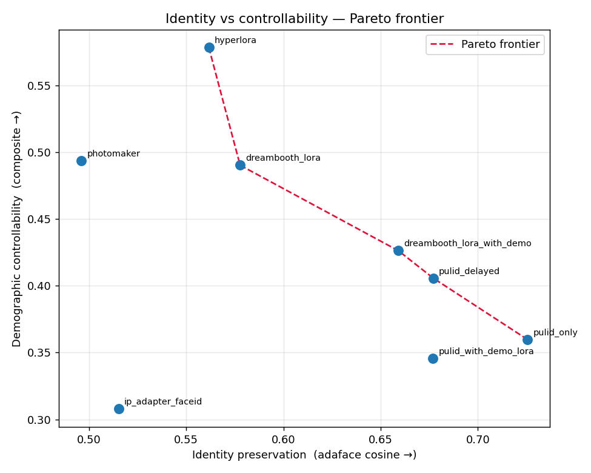
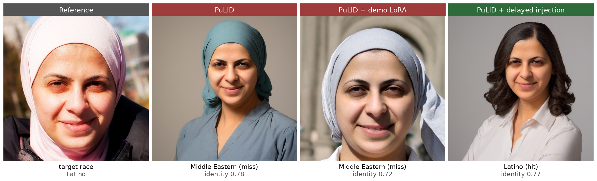

# Demographic-Controllable Identity-Preserving Face Generation

[](https://github.com/OssamaAzab/demographic-controllable-faces/actions/workflows/ci.yml)    

**The finding:** a demographic LoRA that controls age and race well on its own stops working once stacked on a strong identity method — the identity signal overrides it — but a training-free fix, delaying identity injection for the first ~13 of 30 diffusion steps, recovers the surface attributes (race) the stack loses.

A reproducible benchmark of identity-preserving face-generation methods on the
**identity vs demographic-controllability trade-off**, built on SDXL. Given a
single reference photo and a prompt with demographic (age, race) or accessory
attributes, each method tries to render *that person* with the requested
attributes; the benchmark measures how well they keep the identity *and* obey the
prompt, across 10 metrics with explicit Pareto analysis.



## Headline results

8 method configurations, 10 identities, 21 prompts, 5 seeds (7,350+ generations),
all on SDXL 1.0 + the fp16-fix VAE (HyperLoRA on RealVisXL — see note):

| Method | Identity (AdaFace ↑) | Race acc ↑ | Age MAE (MiVOLO ↓) | Accessory ↑ | Controllability ↑ | CLIP-FID ↓ |
|---|---|---|---|---|---|---|
| PuLID | **0.73** | 0.21 | 20.9 | 0.57 | 0.36 | 38.0 |
| PuLID + delayed injection | 0.68 | 0.23 | 20.4 | 0.66 | 0.41 | 33.4 |
| PuLID + demographic LoRA | 0.68 | 0.17 | 19.5 | 0.52 | 0.35 | 33.2 |
| PhotoMaker v2 | 0.50 | 0.27 | 17.6 | 0.80 | 0.49 | 29.4 |
| IP-Adapter FaceID v2 | 0.52 | 0.21 | 21.9 | 0.45 | 0.31 | 32.9 |
| DreamBooth-LoRA | 0.58 | 0.31 | 11.7 | 0.55 | 0.49 | 33.0 |
| DreamBooth + demographic LoRA | 0.66 | 0.23 | 14.0 | 0.51 | 0.43 | 30.3 |
| HyperLoRA (RealVisXL) | 0.56 | **0.39** | 13.6 | 0.80 | **0.58** | 36.7 |

**Qualitative example** (the cell with the largest rescue gain, selected from the
scores). Same reference and prompt `depicted as Latino`: PuLID and PuLID + demographic
LoRA both miss the target (rendered Middle Eastern); only delayed injection recovers
Latino, while AdaFace identity stays ~0.77 across all three.



Three findings:

1. **The trade-off is real and steep.** Identity and controllability pull against
   each other (the Pareto frontier above). PuLID is the identity champion but the
   weakest controller; HyperLoRA is the controllability champion at lower identity.
2. **A stacked demographic LoRA cannot impose control on a strong identity
   method.** Adding the demo LoRA to PuLID *lowers* identity without buying control
   (it is Pareto-dominated by PuLID alone), and the same failure holds for
   HyperLoRA — shown across a `demo_scale` sweep, an `id_scale x demo_scale` grid,
   ArcFace-embedding editing, and two different identity architectures.
3. **Delayed identity injection rescues it, training-free.** Holding identity
   injection off for the first ~13 of 30 diffusion steps lets the prompt set the
   demographic first; `PuLID + delayed injection` dominates `PuLID + demographic
   LoRA` (same identity, higher controllability). The rescue is
   **attribute-dependent**: it recovers *surface* attributes (race) but not
   *structural* ones (age stays identity-locked), because the late identity steps
   re-impose face geometry.

Full analysis, confounds, and limitations in [WRITEUP.md](WRITEUP.md).

## What this does

```
ref:    [one photo of a person]
prompt: "a photo of a 20 year old East Asian man wearing round glasses"
->      that person, rendered with the requested attributes, studio-portrait quality
```

The original contribution was a **demographic LoRA** (rank-32 SDXL LoRA on 36k FFHQ
images with hybrid FairFace + BLIP-2 captions) intended to add demographic control
to identity-preserving generation. The benchmark's honest result reframes it: the
LoRA controls demographics well *on its own* (see below), but that control **does
not transfer when stacked on a strong identity method** — which motivated the
delayed-injection rescue. The project's value is the rigorous mapping of the
trade-off and the mechanistic explanation, not a leaderboard win.

See [PROJECT_PLAN.md](PROJECT_PLAN.md) for the full design rationale.

## Methods compared

| Method | Type | Base | Reference |
|---|---|---|---|
| PuLID (+ ablations) | Attention-injected ID encoder | SDXL 1.0 | [arXiv:2404.16022](https://arxiv.org/abs/2404.16022) |
| PuLID + delayed injection | PuLID with timestep-gated identity (this work) | SDXL 1.0 | — |
| PhotoMaker v2 | Stacked-ID encoder, trigger word | SDXL 1.0 | [arXiv:2312.04461](https://arxiv.org/abs/2312.04461) |
| IP-Adapter FaceID Plus v2 | Adapter + face embedding | SDXL 1.0 | [arXiv:2308.06721](https://arxiv.org/abs/2308.06721) |
| DreamBooth-LoRA | Per-identity LoRA training | SDXL 1.0 | [arXiv:2208.12242](https://arxiv.org/abs/2208.12242) |
| HyperLoRA | Hypernetwork-predicted zero-shot ID-LoRA | RealVisXL v4.0 | [CVPR 2025](https://github.com/bytedance/ComfyUI-HyperLoRA) |

The demographic LoRA can be stacked on PuLID and DreamBooth (the `+ demographic
LoRA` rows). HyperLoRA is base-model incompatible with vanilla SDXL 1.0, so it runs
on RealVisXL v4.0 as a documented exception; a controlled side-test shows its
controllability lead is the *method*, not the base (see WRITEUP).

## Metrics (10)

| Axis | Metrics |
|---|---|
| Identity preservation | ArcFace cosine, **AdaFace cosine** (non-circular cross-check) |
| Age control | **MiVOLO** continuous-age MAE (FairFace age-bucket fallback) |
| Race control | FairFace classifier accuracy (per-class) |
| Accessory control | CLIP zero-shot presence |
| Prompt alignment | CLIP-Score |
| Aesthetic (no-reference) | HPSv2, PickScore |
| Distribution (face-cropped) | CLIP-FID, KID |
| Perceptual | DreamSim |
| Rendering diversity | mean pairwise DreamSim across seeds (read with identity) |

Identity is reported with both ArcFace and AdaFace because methods that inject an
ArcFace embedding (IP-Adapter, HyperLoRA, PuLID) can get an inflated ArcFace score;
AdaFace is the independent check (here they largely agree — PuLID's lead is real).
MiVOLO requires `timm 0.8`, which conflicts with the rest of the stack, so it runs
in an isolated virtualenv via `scripts/09b_mivolo_age.py`.

## The demographic LoRA (standalone)

A rank-32 LoRA on SDXL UNet attention, 15k steps over 36k FFHQ images with hybrid
FairFace + BLIP-2 captions (`configs/demo_lora.yaml`). Checkpoints are selected on
a task-aware (age MAE, race accuracy) Pareto frontier, not validation MSE — the
model overfits past ~4k steps, so **step 4000** was selected over later, worse
checkpoints (`results/figures/checkpoint_pareto.png`).

Per-race control of the selected checkpoint, scored standalone (not stacked):

| Race | white | Black | East Asian | South Asian | Middle Eastern | Latino | Southeast Asian |
|---|---|---|---|---|---|---|---|
| Race accuracy | 1.00 | 1.00 | 1.00 | 0.94 | 0.78 | 0.44 | 0.03 |

So the LoRA *does* control demographics on its own (even the rarest training class,
Middle Eastern at 1.6% of images). Two classes score low for different reasons —
Southeast Asian is a genuine model collapse to the East Asian prior; Latino is
mostly a FairFace measurement limit — detailed in the WRITEUP. The key benchmark
result is that this standalone control **does not survive being stacked** on an
identity method.

## Setup

Linux + CUDA 12 + Python 3.12, single GPU with 20 GB+ VRAM (developed on RTX 4000
Ada). All data/model/output paths auto-detect from the repo root via
`src/dcfaces/paths.py`; caches are kept in-repo under `.cache/`.

```bash
python -m venv .venv && source .venv/bin/activate
pip install -e . && pip install -r requirements.txt
scripts/setup_external.sh        # clone + patch the external method repos
python scripts/00_fetch_weights.py   # download pretrained weights
scripts/setup_mivolo_venv.sh     # isolated venv for the MiVOLO age metric
```

The external identity methods (PuLID, IP-Adapter, PhotoMaker, HyperLoRA, AdaFace,
MiVOLO) are cloned under `external/` at pinned commits and imported, not vendored.
[SETUP.md](SETUP.md) is the full fresh-clone-to-runnable walkthrough, including the
three weights that need a manual download and the dependency pins.

## Running the pipeline

```bash
python scripts/01_download_ffhq.py          # FFHQ subset
python scripts/02_split_ffhq.py             # train/val/test split
python scripts/03_build_identity_gallery.py # 10 demographically diverse references
python scripts/04_caption_ffhq.py           # hybrid BLIP-2 + FairFace captions
python scripts/05_train_demo_lora.py        # demographic LoRA
python scripts/06_eval_checkpoints.py        # Pareto checkpoint selection
python scripts/07_train_dreambooth_lora.py  # per-identity DreamBooth baselines
python scripts/08b_gen_hyperlora_loras.py   # HyperLoRA per-identity ID-LoRAs
python scripts/08_run_benchmark.py          # generate all method x id x prompt x seed
python scripts/09b_mivolo_age.py            # MiVOLO ages (run in .venv-mivolo)
python scripts/09_compute_metrics.py        # 10-metric suite + Pareto
```

The benchmark run is resumable (existing images are skipped) and the metric scoring
caches per-image results in `results/benchmark/scores*.jsonl`.

## Repository structure

```
src/dcfaces/
  paths.py            single source of truth for I/O paths
  demographics.py     FairFace ViT trio (age/race/gender)
  faces.py            insightface pose/detection
  captioning/         BLIP-2 captioner
  training/           SDXL LoRA training loops
  benchmark/          prompt expansion + per-method generators (incl. delayed PuLID)
  metrics/            identity (ArcFace/AdaFace), aesthetic (HPSv2/PickScore),
                      perceptual (DreamSim), distribution (CLIP-FID/KID), clip_score
configs/              all hyperparameters as YAML
scripts/              numbered runnables (01-09 + 08b/09b)
results/              tracked tables (CSV), figures (PNG), per-image scores (JSONL),
                      a curated full-res sample set (samples/), and a 512px preview of
                      every method/identity/prompt cell (gallery/); the 13 GB of
                      full-resolution generations are gitignored, regenerated by the pipeline
```

## Limitations and honesty notes

- **The headline contribution is the negative + the rescue, not a SOTA win.** The
  naive demographic-LoRA stacking fails; the rescue (delayed injection) recovers
  only surface attributes.
- **Grayscale confound, fixed.** PuLID and IP-Adapter on vanilla SDXL produced
  near-grayscale outputs, which unfairly penalized their FID/aesthetic; the
  benchmark uses an anti-grayscale negative prompt and the affected methods were
  regenerated in color.
- **Race measurement.** FairFace conflates Southeast/East Asian (when prompted
  "Southeast Asian", outputs are labeled East Asian ~30% of the time) and
  Latino/white; per-class accuracy reflects agreement with an imperfect proxy.
- **HyperLoRA base confound, quantified.** It runs on RealVisXL; a side-test shows
  its controllability is base-independent but its identity gets a modest base boost.
- Single GPU, single dataset (FFHQ), 10 identities — a focused study, not
  large-scale.

## Ethics

Face generation has dual-use risks and demographic classifiers carry bias concerns.
This project uses only public-domain FFHQ identities, treats the seven FairFace
classes as a coarse **visual-phenotype proxy** (not a biological or cultural claim),
documents FFHQ's demographic skew and FairFace's own confusions, and reports race
accuracy as agreement with that proxy rather than ground truth. Any deployment would
require watermarking and attribution safeguards. Full discussion in the WRITEUP.

## License

[MIT](LICENSE).

## Acknowledgments

FFHQ (NVlabs), SDXL (Stability AI), RealVisXL (SG161222), PuLID / PhotoMaker /
HyperLoRA (ByteDance), IP-Adapter (Tencent), AdaFace, FairFace, MiVOLO, HPSv2,
PickScore, DreamSim, clean-fid.
